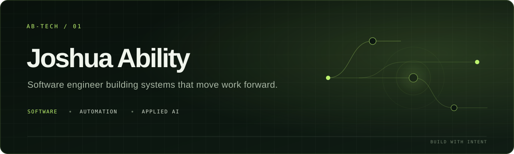

<p align="center">
  
</p>

<p align="center">
  <a href="https://ab-tech-dev.github.io/"><strong>Portfolio ↗</strong></a>
  &nbsp;·&nbsp;
  <a href="https://www.linkedin.com/in/joshua-ability/">LinkedIn</a>
  &nbsp;·&nbsp;
  <a href="mailto:mrjoshuaability@gmail.com">Email</a>
</p>

## I turn operational friction into software.

I’m **Joshua Ability**, a software engineer focused on products that make complicated work feel clear. I build customer-facing applications, internal operations systems, business automations, and applied-AI workflows—from the first product decision to deployment.

```text
CURRENT SIGNAL  →  thoughtful software · practical automation · useful AI
```

### What I bring

- **End-to-end product engineering** — interfaces, APIs, data models, integrations, and deployment as one connected system.
- **Automation with a reason** — fewer manual handoffs, fewer errors, and more time for the work that needs people.
- **Operational thinking** — I design around how a business actually works, not just what looks good in a demo.
- **Applied AI with boundaries** — retrieval, assistants, and intelligent workflows with clear sources and human oversight.

## Selected systems

<table>
  <tr>
    <td width="50%" valign="top">
      <sub>01 · CLINIC EXPERIENCE + OPERATIONS</sub><br><br>
      <strong>Jay Opticals & Eye Clinic</strong><br>
      A cinematic public website and eyewear catalogue paired with secure tools for patients, appointments, prescriptions, inventory, billing, reports, and notifications.<br><br>
      <code>Next.js</code> <code>TypeScript</code> <code>PWA</code><br><br>
      <a href="https://jay-opticals-oms.vercel.app/">Live project ↗</a> · <a href="https://github.com/ab-tech-dev/jay-opticals-eye-clinic">Source</a>
    </td>
    <td width="50%" valign="top">
      <sub>02 · COMMERCE INFRASTRUCTURE</sub><br><br>
      <strong>Dandelionz</strong><br>
      A multi-vendor commerce platform spanning catalogues, role-based operations, orders, Paystack payments, wallets, referrals, delivery tracking, and administration.<br><br>
      <code>Django REST</code> <code>PostgreSQL</code> <code>Redis</code><br><br>
      <a href="https://app.dandelionz.com.ng/">Live project ↗</a> · <a href="https://github.com/ab-tech-dev/dandelionz">Source</a>
    </td>
  </tr>
  <tr>
    <td width="50%" valign="top">
      <sub>03 · LIVE CLIENT EXPERIENCE</sub><br><br>
      <strong>Infinity Hair & Beauty</strong><br>
      A responsive salon experience that turns a large service catalogue into one visual journey, with direct booking paths and polished editorial motion.<br><br>
      <code>Frontend</code> <code>Responsive UX</code> <code>Content system</code><br><br>
      <a href="https://infinitysalon-flame.vercel.app/">Live project ↗</a> · <a href="https://github.com/ab-tech-dev/infinitysalon">Source</a>
    </td>
    <td width="50%" valign="top">
      <sub>04 · PRIVATE APPLIED AI</sub><br><br>
      <strong>Local Review Intelligence</strong><br>
      A retrieval assistant that answers questions from restaurant feedback while keeping inference and embeddings local, with caching for repeated queries.<br><br>
      <code>Ollama</code> <code>LangChain</code> <code>Chroma</code><br><br>
      <a href="https://github.com/ab-tech-dev/Local_AI_Agent">Explore source ↗</a>
    </td>
  </tr>
</table>

### Also building

- [Medical Knowledge Assistant](https://github.com/ab-tech-dev/medical_chatbot) — semantic retrieval over medical references with Flask, Pinecone, Docker, and AWS delivery.
- [AI Voice Agent](https://github.com/ab-tech-dev/ai_voice_agent) — experiments in voice-driven AI workflows and conversational automation.

## Working stack

| Product | Systems | Intelligence | Delivery |
| --- | --- | --- | --- |
| TypeScript, React, Next.js | Python, Django, FastAPI, Node.js | LLM integrations, RAG, local inference | PostgreSQL, Redis, Docker, GitHub Actions |

## Currently

- Shipping complete systems where the public experience and internal operations reinforce each other.
- Turning repeated business processes into reliable, observable workflows.
- Exploring smaller, focused AI tools that earn trust through useful answers and clear boundaries.
- Available for product builds, automation partnerships, and thoughtful technical collaboration.

## Let’s build something that earns its place.

If you have a process that is too manual, a product that needs clearer thinking, or an AI idea that needs practical boundaries, [send me a note](mailto:mrjoshuaability@gmail.com) or explore more work at **[ab-tech-dev.github.io](https://ab-tech-dev.github.io/)**.

<p align="right"><sub>Built with intent. Kept useful.</sub></p>
